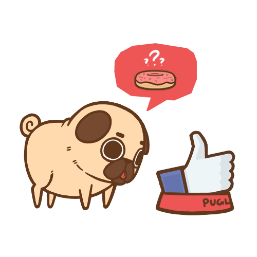

# Pugback
Pugback is a simple class that provides simple callbacks to c++. This is built to provide simple propagation of data for example user input. The user input can create a call back trigger for a group and any number of listeners can wait for it and process it.



## General information
1. I use Mutex to make this thread safe, you can disable this by undefining 'PUG_ENABLE_THREADING'.
2. Callbacks for a group are called one at a time (a for loop). If a callback takes a long period of time to process the other callbacks will wait for it to finish before being called.
3. If a callback raises an exception it will just be ignored by the callback function.

## Usage
There is a global pug engine that is defined in the file that should be used. There is not a really good reason to define a pug_callback_engine for each callback unless you have a huge number of groups.

1. Add a hook with PUG.AddCallBack().
2. Call the hook with PUG.DoCallBack().


```c++
#include <iostream>

#include "Pugback.h"


int Example(void *A) {

	std::string Tmp = PugGetValue<std::string>(A);

	return 0;
}

int main() {

		// Create a callback "name", "group" and callback function.
	PUG.AddCallBack("Callback Name", "Example Group", Example);

		// Example value to send.
	std::string Data = "Pugs";

		// Preform the callback.
	PUG.DoCallBack("Example Group", &Data);

		// Print out the list of groups and hooks.
	PUG.PUG_PS();


	return 0;
}
```
